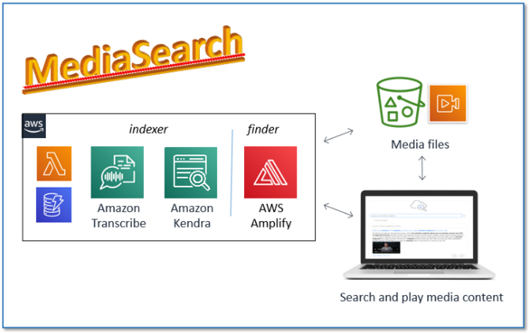
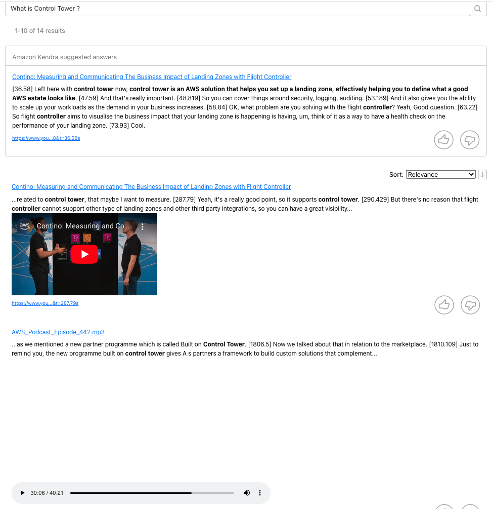
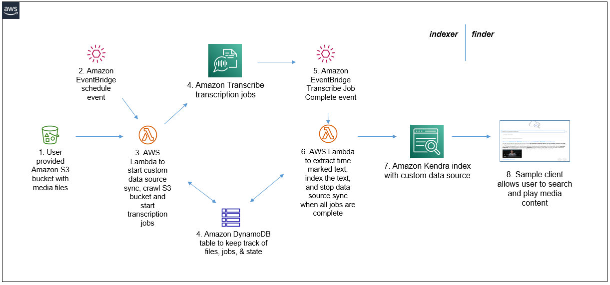

# MediaSearch project (aws-kendra-transcribe-search)

This solution makes audio and video media content searchable in an Amazon Kendra index.

It uses Amazon Transcribe to convert media audio tracks to text, and Amazon Kendra to provide intelligent search so that your users can find the content they are looking for, 
even when it's embedded in the sound track of your audio or video files. 
The solution also provides an enhanced Kendra query application which lets users play relevant sections of original media files returned in query results, directly from the search page.



The MediaSearch solution has two components.  
- The first component, the MediaSearch indexer, finds and transcribes audio and video files stored in an S3 bucket. It prepares the transcriptions by embedding time markers at the start of each sentence, and it indexes each prepared transcription in a new or existing Kendra index. It runs for the first time when you install it, and subsequently it runs on an interval that you specify, maintaining the Kendra index to reflect any new, modified, or deleted files.  
- The second component, the MediaSearch finder, is a sample web search client that you use to search for content in your Kendra index. It has all the features of a standard Kendra search page, but it also includes in-line embedded media players in the search result, so you can not only see the relevant section of the transcript, but also play the corresponding section from the original media without navigating away from the search page.


See the blog post to get started: [Making your audio and video files searchable using Amazon Transcribe and Amazon Kendra](TODO)

## Architecture

The MediaSearch solution has an event driven serverless computing architecture, depicted in the diagram above.
1.	You provide an Amazon S3 bucket containing the audio and video files you want to index and search.
2.	Amazon EventBridge generates events on a repeating interval (e.g. every 2 hours, every 6 hours, etc.) These events invoke the AWS Lambda function (3)
3.	The AWS Lambda function is invoked initially when the CloudFormation stack is first deployed, and then subsequently by the scheduled events from Amazon EventBridge (2). A Kendra data source sync job is started. The Lambda function lists all the supported media files (FLAC, MP3, MP4, Ogg, WebM, AMR, or WAV) stored in the user provided S3 bucket (1).  
    1. Each new file is added to the Amazon DynamboDB tracking table (4) and submitted to be transcribed by an Amazon Transcribe job.   
    2. Any files that has been previously transcribed will be submitted for transcription again only if it has been modified since it was previously transcribed.  
The DynamoDB table (4) is updated to reflect the transcription status and last modified timestamp of each file. Any tracked files that no longer exist in the S3 bucket are removed from the DynamoDB table and from the Kendra index.
If no new or updated files were discovered, the Kendra data source sync job is immediately stopped.  
4.	The DynamoDB table holds a record for each media file with attributes to track transcription job names and status, and last modified timestamps. 
5.	As each Amazon Transcribe job completes, Amazon EventBridge generates a Job Complete event which invokes an instance of Lambda function (6). 
6.	The AWS Lambda function processes the transcription job output, generating a modified transcription that has a time marker inserted at the start of each sentence. This modified transcription is indexed in Amazon Kendra (7), and the job status for the file is updated in DynamoDB table (4). When the last file has been transcribed and indexed, the Kendra data source sync job is stopped.
7.	The Kendra index is populated and kept in sync with the transcriptions of all the media files in the S3 bucket monitored by the MediaSearch indexer component, integrated with any additional content from any other provisioned data sources. The media transcriptions are used by Kendra’s intelligent query processing, allowing users to find content and answers to their questions.
8.	The sample ‘finder’ client application enhances users’ search experience by embedding an inline media player with each Kendra answer that is based on a transcribed media file. The client uses the time markers embedded in the transcript to start media playback at the relevant section of the original media file.

## Indexer

The Indexer crawler and jobcomplete lambda function code is in the lambda directory.

## Finder

The Finder application is based on the Kendra sample search application, and is in the src directory. It is built during deployment as an Amplify Console application.


## CloudFormation Templates

The cfn-templates directory contains CloudFormation templates used to deploy the MediaSearch Indexer and Finder applications
- msindexer.yaml: Deploys the indexer, including (optionally) a Kendra index, a DynamoDB table to keep track of the state of media files, Lambda functions, IAM roles, EventBridge Events etc.
- msfinder.yaml: Deploys the finder web application using AWS Amplify, including a CodeCommit repository, an AWS Amplify console application, and IAM roles
The templates contain tokens for bucket names, zipfile names, etc. The publish scipt, publish.sh, is used to replace these tokens and deploy templates and code artifacts to a deployment bucket

## Build and Publish MediaSearch

Use the [publish.sh](./publish.sh) bash script to build the project and deploy cloud formation templates to your own deployment bucket. 

Prerequisite: You must already have the [AWS CLI](https://docs.aws.amazon.com/cli/latest/userguide/cli-chap-install.html) installed and configured, or use an AWS Cloud9 environment.

To deploy to non-default region, set AWS_DEFAULT_REGION to a region supported by Amazon Kendra and Amazon Transcribe. See: [AWS Regional Services](https://aws.amazon.com/about-aws/global-infrastructure/regional-product-services/) 
E.g. to deploy in Ireland run `export AWS_DEFAULT_REGION=eu-west-1` before running the publish script.

Run the script with 4 parameters:
```
./publish.sh cfn_bucket cfn_prefix [dflt_media_bucket] [dflt_media_prefix]

- cfn_bucket: name of S3 bucket to deploy CloudFormation templates and code artifacts. if bucket does not exist it will be created.
- cfn_prefix: artifacts will be copied to the path specified by this prefix (path/to/artifacts/)
- dflt_media_bucket: (Optional) sets the default media bucket in the template.. for example, use this default installations to index sample files in the bucket you provide. Must be in same region as cfn_bucket.
- dflt_media_prefix: (Optional) default path to (sample) media files in the dflt_media_bucket
```

It builds code zipfiles and replaces the tokens in the templates to reflect the parameters you specify and the zipfile names, and copys templates and zipfiles to the cfn_bucket.
When complete, it displays the URLS for the CloudFormation templates and 1-click URLs for launching the stack create in CloudFormation , e.g.:
```
Outputs
Indexer Template URL: https://s3.eu-west-1.amazonaws.com/bobs-cfn_bucket/mediasearch/msindexer.yaml
Finder Template URL: https://s3.eu-west-1.amazonaws.com/bobs-cfn_bucket/mediasearch/msfinder.yaml
Indexer - CF Launch URL: https://eu-west-1.console.aws.amazon.com/cloudformation/home?region=eu-west-1#/stacks/create/review?templateURL=https://s3.eu-west-1.amazonaws.com/bobs-cfn_bucket/mediasearch/msindexer.yaml
Finder - CF Launch URL: https://eu-west-1.console.aws.amazon.com/cloudformation/home?region=eu-west-1#/stacks/create/review?templateURL=https://s3.eu-west-1.amazonaws.com/bobs-cfn_bucket/mediasearch/msfinder.yaml
Done
```
If you specify a value for dflt_media_bucket and it is in a different AWS region than the cfn_bucket, the script will display a warning, e.g.:
```
WARNING!!! Default media bucket region (us-east-1) does not match deployment bucket region (eu-west-1).. Media bucket (bobs-dflt_media_bucket) must be in same region as deployment bucket (bobs-cfn_bucket)
```
If you see this warning, run the publish script again with different buckets, to resolve the problem. If you deploy a stack using a media bucket in a 
region other than the region you deploy in, your media files will not be transcribed or indexed.


## Learn More

See the blog post for much more information, including:
- How to easily deploy MediaSearch using publically published templates and sample files in us-east-1
- Cost information
- Tutorial for getting started and testing with the sample files
- How to monitor and troubleshot problems
[Making your audio and video files searchable using Amazon Transcribe and Amazon Kendra](TODO)


## Contribute

Fork the MediaSearch GitHub repository, enhance the code, and send us pull requests so we can incorporate and share your improvements!
Here are a few suggestions for features you might want to implement:
- Improve transcription accuracy for your media domain by adding support for Amazon Transcribe domain specific custom language models or custom vocabulary.
- Enhance your search using filters and facets by adding support for Kendra metadata, or go a step further by integrating Amazon Comprehend to automatically create filters and facets using detected entities as illustrated in this great blog post:  Build an intelligent search solution with automated content enrichment
- Extend MediaSearch to additional user channels, for example, integrate QnABot with your MediaSearch Kendra index so your users can get media sourced answers via their chatbots on web pages, Slack, or Amazon Connect contact centers. 

We’d love to hear from you. Let us know what you think using the repo issues forum. 

